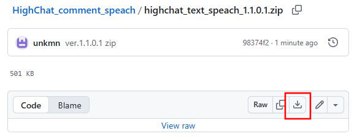
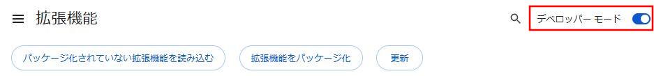
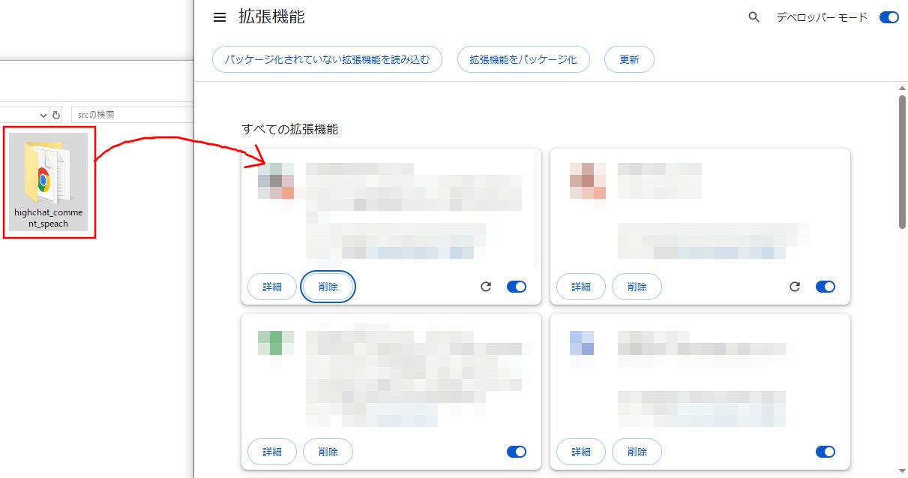
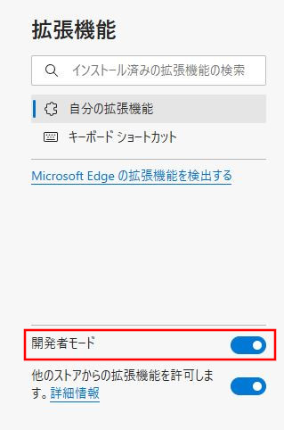
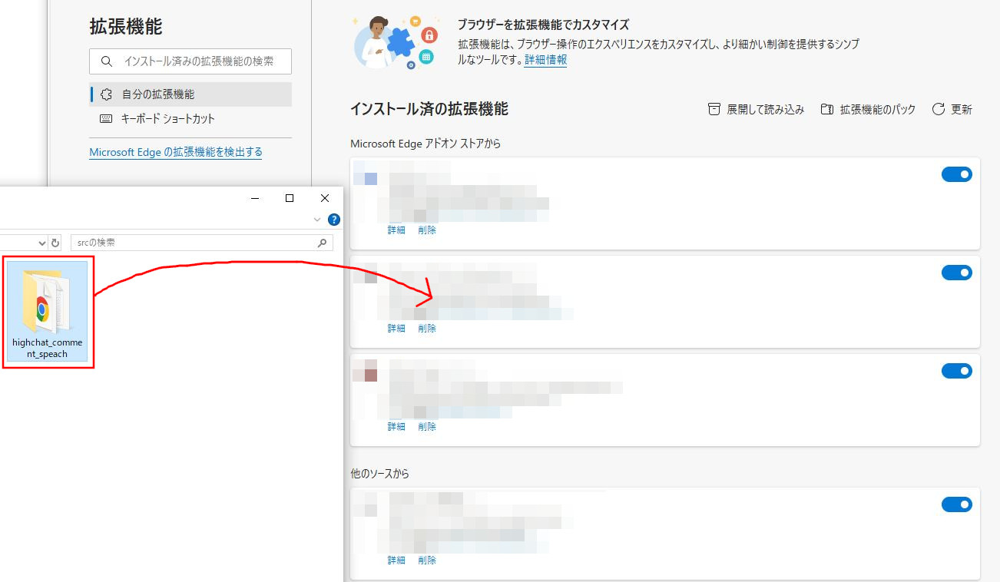
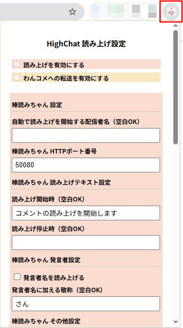
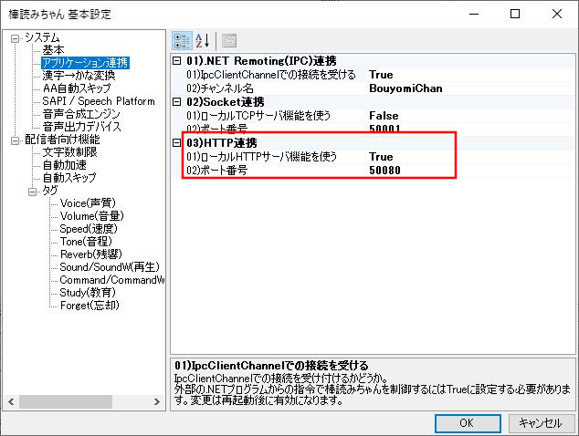
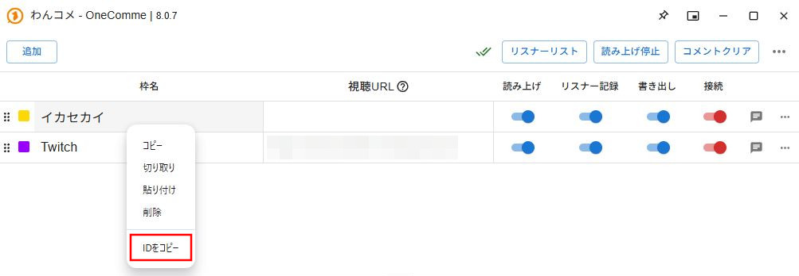
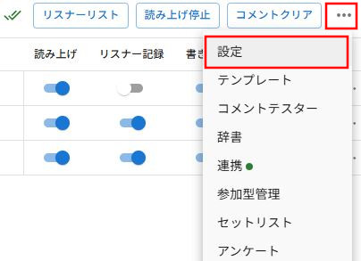

# ﾅﾆｺﾚ<!-- omit in toc -->
Highchatでの配信画面において、コメントを棒読みちゃんで読み上げる拡張機能です。 
ｸﾝﾘﾆﾝｻﾝが既に提供されている拡張機能もありますが、棒読みちゃん側のWebSocketプラグインの動作に不安があるため、 
HTTP連携を利用した読み上げをやってみたくて作りました。 
 
また、配信者向けコメントビューアーアプリであるわんコメとの連携機能もあります。 
例えばTwitchとHighChatのコメントを画面上で同じ領域に表示したい場合に活用できます。 
 
▼わんコメ公式サイト▼ 
https://onecomme.com/ 
 
また、念のため簡易的な荒らし対策としてNGワード機能を実装しています。 
普段は必要ないとは思いますが、もし荒らしが来た時の防衛手段は有ったほうが良いと思ったので作ってみました。 
 
Google Chrome(141.0.7390.108)、Microsoft Edge(141.0.3537.99)で動作確認済

 

**▼読み上げ対象外となる文字列** 
- URL（常に「URL省略」と読まれます）
- アスキーアート（常に「アスキーアート省略」と読まれます）

 

# ダウンロード<!-- omit in toc -->
[＞＞＞ HighChat チャット読み上げ ＜＜＜](https://github.com/unkmn/HighChat_comment_speach/blob/main/highchat_comment_speach_1.1.0.3.zip) 
 
リンク先のダウンロードボタン（下図参照）からZIPファイルをダウンロードできます。 
 

 

- 2025/11/15 ver.1.1.0.3
  - 棒読みちゃん連携、わんコメ連携の両方がONの状態で、どちらか片方をOFFにした時点で動作を停止していた問題を修正
  - 棒読みちゃん設定「発言者名を読み上げる」が正常に機能していない不具合を修正
    - わんコメ連携もONの場合、「発言者名を読み上げる」OFFでも名前を読み上げていた

 

過去の変更履歴（クリックで展開）

- 2025/11/15 ver.1.1.0.2
  - 棒読みちゃん設定「改行を反映する」が機能していない不具合を修正
    - 棒読みちゃんで読み上げ時にもわんコメ連携設定側の「改行を反映する」を参照していました
- 2025/11/09 ver.1.1.0.1
  - デフォルトアイコン用ファイルパスを修正
- 2025/10/31 1.1.0.0
  - わんコメ連携機能を追加
- 2025/10/26 1.0.0.1
  - Highchat独自の絵文字を棒読みちゃんに転送する場合、文字列を":"で囲まないように修正
  - URLに "https://ikasekai.com/highchat/live/" を含むページ以外では「読み上げを有効にする」チェックボックスを無効化するよう修正
- 2025/10/26 1.0.0.0
  - Highchat内で配布 (Googleストアではまだ未公開)

# 目次<!-- omit in toc -->
- [導入方法](#導入方法)
  - [Google Chrome への導入](#google-chrome-への導入)
  - [Microsoft Edge への導入](#microsoft-edge-への導入)
- [設定項目](#設定項目)
  - [設定 - 棒読みちゃん](#設定---棒読みちゃん)
    - [棒読みちゃん 設定](#棒読みちゃん-設定)
    - [棒読みちゃん 読み上げテキスト設定](#棒読みちゃん-読み上げテキスト設定)
    - [棒読みちゃん 発言者設定](#棒読みちゃん-発言者設定)
    - [棒読みちゃん その他設定](#棒読みちゃん-その他設定)
  - [設定 - わんコメ](#設定---わんコメ)
    - [わんコメ 連携設定](#わんコメ-連携設定)
    - [わんコメ 読み上げテキスト設定](#わんコメ-読み上げテキスト設定)
    - [わんコメ 匿名・未ログイン者の発言](#わんコメ-匿名未ログイン者の発言)
    - [わんコメ その他設定](#わんコメ-その他設定)
- [使い方](#使い方)
  - [棒読みちゃん連携の使い方](#棒読みちゃん連携の使い方)
  - [わんコメ連携の使い方](#わんコメ連携の使い方)

 

# 導入方法
## Google Chrome への導入
1. 拡張機能ページ（chrome://extensions/）を開く
2. 拡張画面右上の「デベロッパー モード」をONにする 
3. ダウンロードしたZIPを解凍した中身「highchat_comment_speach」フォルダを拡張機能メニューへドラッグ＆ドロップ 

 

## Microsoft Edge への導入
1. 拡張機能の管理（edge://extensions/）を開く
2. 左メニューバーの「開発者モード」をONにする 
3. ダウンロードしたZIPを解凍した中身「highchat_comment_speach」フォルダを拡張機能メニューへドラッグ＆ドロップ 

 

# 設定項目
アドレスバー横のパズルピースのようなアイコンを開くと拡張機能リストが出ます。 
↓の画像はChromeですが、Edgeでも大体同じです。 
 
赤枠で囲っているピンのアイコンを押して色がついた状態にすると、アドレスバーの横に常に表示されるようになります。 
 
拡張機能のアイコンを押すと、設定画面が表示されます。 
 
 

## 設定 - 棒読みちゃん
### 棒読みちゃん 設定

**自動で読み上げを開始する配信者名（空白OK）** 
配信ページを開いた時、この欄に設定した文字列と配信者名が一致した場合、自動で棒読みちゃんの連携をONにします。 
 

**棒読みちゃん HTTPポート番号** 
棒読みちゃんのHTTP連携用ポート番号を入力します。 
棒読みちゃんの設定は次の手順で確認できます。 
1. 棒読みちゃんを起動して **F10** を押す
2. 「アプリケーション連携」の中の **03)HTTP連携** の欄を確認する 
   - **01)ローカルHTTPサーバ機能を使う** は **True** に設定しておくことが必須です
   - **02)ポート番号** の番号が、拡張機能のHTTPポート番号入力欄にセットすべき数値です。デフォルトでは50080です

 

### 棒読みちゃん 読み上げテキスト設定
**読み上げ開始時（空白OK）** 
「読み上げを有効にする」チェックがONになった時に読み上げるテキストです。 
空白にすると何も読み上げません。 
動作が正常に開始したかどうかを確認するためにも、何らかのテキストは設定しておくことをオススメします。 
 

**読み上げ停止時（空白OK）** 
「読み上げを有効にする」チェックがOFFになった時に読み上げるテキストです。 
空白にすると何も読み上げません。 
 

### 棒読みちゃん 発言者設定
**発言者名を読み上げる** 
ONにすると、チャットの発言者の名前も読み上げます。 
 

**発言者名に加える敬称（空白OK）** 
発言者名を読み上げる時に付け加える敬称を設定できます。 
敬称に限らず、"：" などの記号でも構いません。 
 

### 棒読みちゃん その他設定
**改行を反映する** 
チェックをONにすると、改行ごとに文章を区切ります。 
OFFの場合、改行は半角スペースに置換されます。 
 

## 設定 - わんコメ
### わんコメ 連携設定
**自動で連携を開始する配信者名（空白OK）** 
配信ページを開いた時、この欄に設定した文字列と配信者名が一致した場合、自動でわんコメ連携をONにします。 
 

**連携先のわんコメID** 
連携したいわんコメの枠のIDをここに入力します。 
わんコメ枠のIDは以下の方法で取得できます。 
 
連携先の枠を **右クリック＞IDをコピー** でクリップボードにIDがコピーされます。 
 

**拡張機能ID** 
この欄は入力できません。 
ここに表示されているIDをコピーして、わんコメの以下の欄に貼り付けてください。 
 
三点リーダ "…" を押して「設定」を開く 
 
 
「API」のタブの「許可ホスト」欄に、コピーした拡張機能IDを貼り付ける 
 

### わんコメ 読み上げテキスト設定
**連携開始時（空白OK）** 
「わんコメへの転送を有効にする」チェックがONになった時に読み上げるテキストです。 
空白にすると何も読み上げません。 
動作が正常に開始したかどうかを確認するためにも、何らかのテキストは設定しておくことをオススメします。 
 

**連携停止時（空白OK）** 
「わんコメへの転送を有効にする」チェックがOFFになった時に読み上げるテキストです。 
空白にすると何も読み上げません。 
 

### わんコメ 匿名・未ログイン者の発言
**匿名の発言に付ける名前（空白OK）** 
匿名ユーザーによる発言の場合、代わりに名前欄に表示する文字列を設定できます。 
空白の場合は名前欄が空欄になります。 
 

**未ログイン者の名前の後に付ける文言（空白OK）** 
未ログイン者の場合、名前の後ろに未ログインであることがわかる文言を設定できます。 
空白の場合には何も表示しません。 
 

### わんコメ その他設定
**改行を反映する** 
チェックをONにすると、改行そのままにわんコメへ転送します。 
OFFの場合、改行は半角スペースに置換されます。 

 

# 使い方
## 棒読みちゃん連携の使い方
1. 「棒読みちゃん HTTPポート番号」を設定する
2. Highchatの配信ページを開いた状態で「読み上げを有効にする」チェックをONにする

## わんコメ連携の使い方
1. 「連携先のわんコメID」を設定する
2. 「拡張機能ID」をコピーして、わんコメ設定の「API」タブ内の「許可ホスト」欄に貼り付ける
3. Highchatの配信ページを開いた状態で「わんコメへの転送を有効にする」チェックをONにする